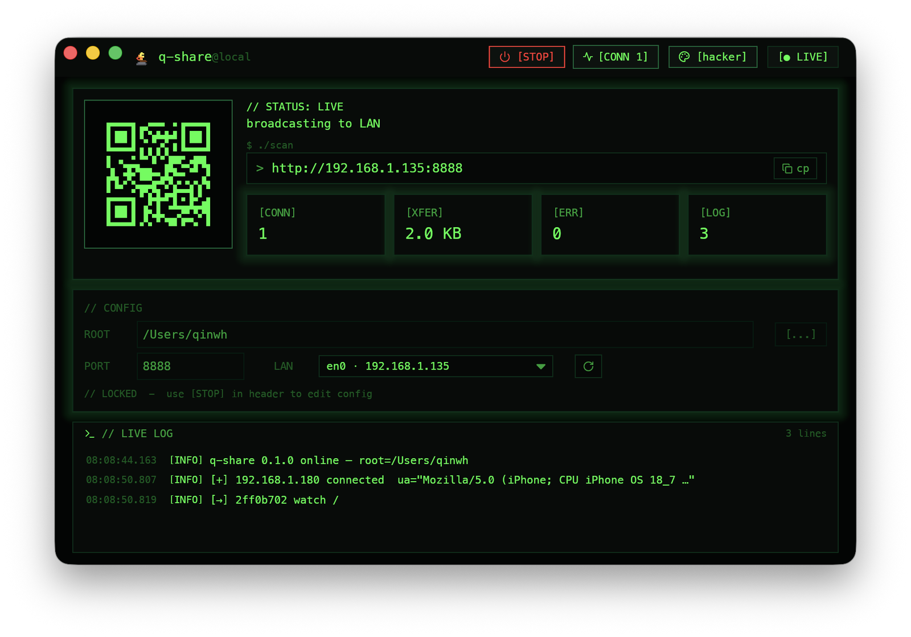
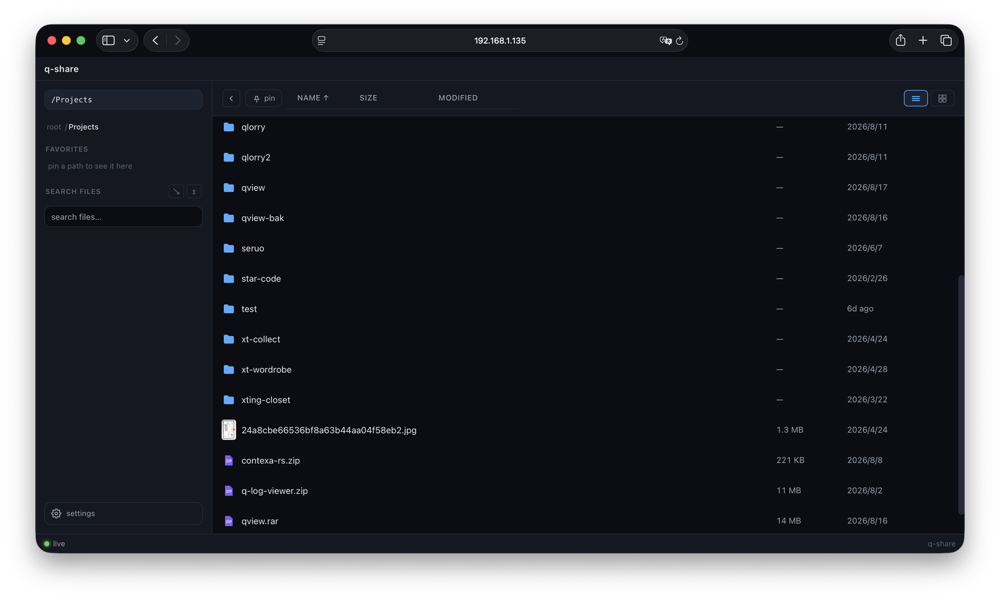
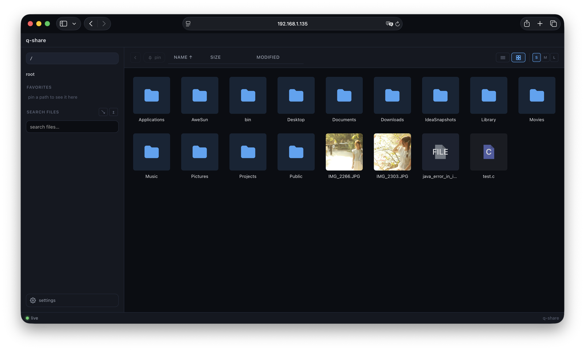
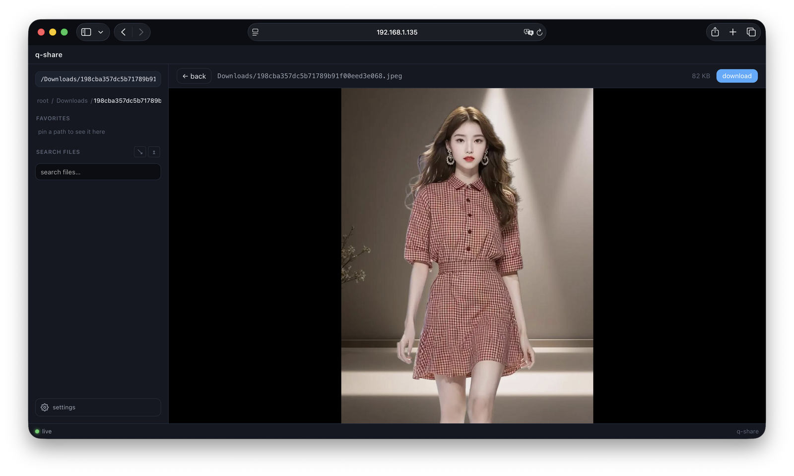
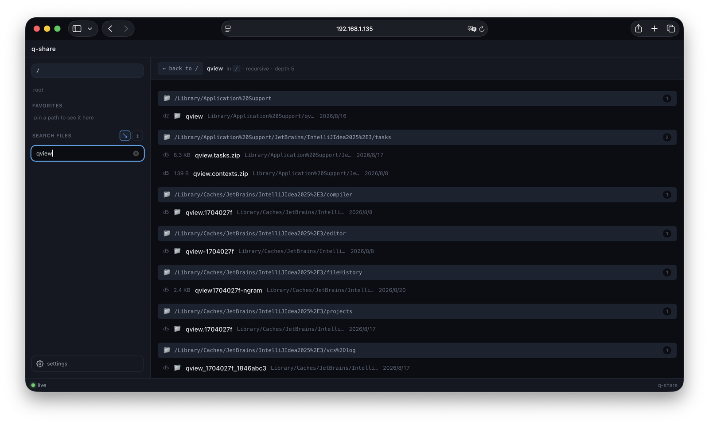
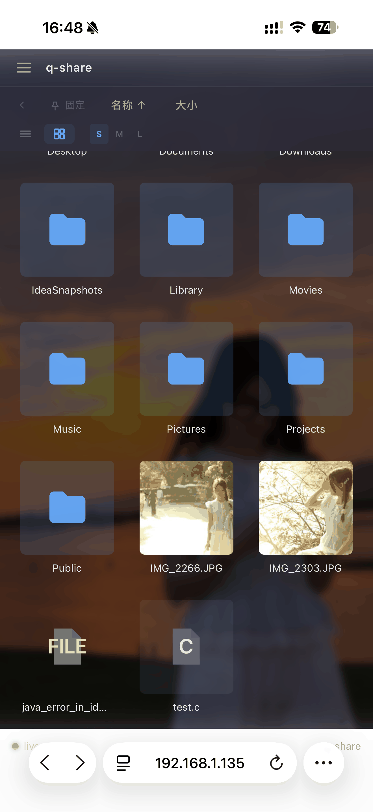

# q-share

[**English**](README.md) · **中文**

[](https://github.com/qinwenhui/q-share/actions/workflows/ci.yml)
[](LICENSE)

> **零配置局域网文件分享** —— 选一个文件夹，得到一个 URL 和二维码，局域网内任何设备都能打开。

`q-share` 把任意本地目录变成一个现代、快速的浏览器文件管理器，局域网内任何人都能访问。无需账号、无需上传、无需云服务 —— 浏览、预览、搜索、下载，仅此而已。

可以用原生 GUI，也可以用命令行无头版：

```
$ qshare-cli -r ~/Videos

  q-share  0.1.1
  ─────────────────────────────────────────────────
  shared  /Users/me/Videos
  url     http://192.168.1.42:8888
  qr      ▆▆▆▆▆▆ ▆▆▆  ▆▆▆▆▆ ▆▆▆▆▆▆
          ▆  ▆▆▆ ▆▆▆▆ ▆  ▆   ▆  ▆
          ▆▆ ▆▆▆ ▆ ▆▆ ▆▆▆▆▆ ▆▆▆▆
  ─────────────────────────────────────────────────
  active     3
  bytes      12.4 MB
  errors     0
```

或者启动原生 GUI —— 一个窗口搞定：选目录，点 **Start**，复制 URL 或扫二维码。实时计数会随连接滚动：

```
$ qshare
```

- [截图](#截图)
- [亮点](#亮点)
- [功能](#功能)
- [安装](#安装)
- [使用](#使用)
- [Web 界面](#web-界面)
- [架构](#架构)
- [API](#api)
- [开发](#开发)
- [安全](#安全)
- [贡献](#贡献)

---

## 截图

| 原生 GUI —— 运行中的仪表盘 | Web —— 目录浏览 |
| --- | --- |
|  |  |

| Web —— 网格视图 | Web —— 媒体预览 |
| --- | --- |
|  |  |

| Web —— 搜索 | Web —— 移动端 |
| --- | --- |
|  |  |

---

## 亮点

- **零配置** —— 选目录即得 URL，无需账号、无需设置、无需云。
- **三套前端** —— SolidJS Web UI、iced 原生 GUI（macOS / Windows）、ratatui 终端 UI（Linux）。
- **实时** —— SSE 把文件系统事件推送到浏览器；GUI 显示实时连接统计。
- **可发现** —— `_qshare._tcp.local.` mDNS 服务自动出现在局域网内。
- **快** —— 目录 TTL 缓存 + Range 断点下载 + 图片 / 视频 / PDF / 代码预览。
- **小** —— CLI 约 4 MB，GUI 约 12 MB。运行时无需 Node（前端已内嵌进二进制）。
- **安全** —— 严格沙箱拒绝 `..` 和绝对路径逃逸；只读访问。

---

## 功能

- **浏览** —— 虚拟滚动的列表或缩略图网格，按名称 / 大小 / 修改时间排序。
- **搜索** —— 对文件名递归子串 / 正则搜索，独立结果页。
- **预览** —— 图片、视频（HTTP Range，可拖动进度）、PDF、语法高亮代码、纯文本。
- **下载** —— 单击下载，支持暂停 / 续传 / 定位（`Range`）。
- **实时更新** —— 文件变化无需刷新即出现（SSE）。
- **移动端** —— 响应式布局，触控返回 / 上级。
- **收藏与固定** —— 侧边栏书签 + 工具栏固定目录按钮。

---

## 安装

Linux、macOS、Windows 的预编译二进制挂在每个 [Release](https://github.com/qinwenhui/q-share/releases) 页面。也可以从源码构建：

> **macOS 首次打开**：应用是 ad-hoc 签名、未做 Apple 公证，Finder 可能会提示
> "无法验证开发者"。右键点应用选 **打开**，或执行一次清除隔离标记：
>
> ```bash
> xattr -cr q-share.app
> ```

```bash
git clone https://github.com/qinwenhui/q-share.git
cd q-share

# 一次性：安装前端依赖
just web-install   # 或 cd web && npm install

# Release 构建（内嵌前端产物）
just build         # 或 cd web && npm run build && cd .. && cargo build --release
```

**环境要求**：Rust 1.88+、Node 20+。

构建产物：

| 二进制 | Crate | 说明 |
|---|---|---|
| `target/release/qshare` | `qshare-gui` | 原生 GUI（macOS / Windows） |
| `target/release/qshare-cli` | `qshare-cli` | 无头 CLI |
| `target/release/qshare-tui` | `qshare-tui` | 终端 UI |

---

## 使用

### CLI —— `qshare-cli`

```bash
qshare-cli --root <DIR> [options]

Options:
  -r, --root <DIR>        要共享的目录
  -p, --port <PORT>       监听端口                          [default: 8888]
      --host <IP>         绑定的主机 / IP                    [default: 0.0.0.0]
      --show-hidden       列表里包含点开头文件
      --cache-ttl <SECS>  目录缓存 TTL（秒）                [default: 5]
      --no-qr             不在终端打印二维码
```

示例：

```bash
qshare-cli --root ~/Movies --port 9000 --show-hidden
```

### GUI —— `qshare`

```bash
qshare                    # 零配置 —— 在界面里选文件夹
qshare --root ~/Movies    # 预置共享目录
qshare --port 9000        # 覆盖默认端口（8888）
```

> GUI 始终绑定 `0.0.0.0`，这样本机和局域网设备都能连接；界面显示的 URL 使用自动探测到的局域网 IP。

功能：

- Start 之后实时显示 URL + 二维码（点击复制）
- 实时 **active** / **bytes** / **errors** 计数
- 复制 / 启动 / 停止的 toast 通知
- 顶栏状态胶囊反映服务状态（idle / starting / running / error）
- 可切换视觉风格（hacker / tech / retro / anime）

### TUI —— `qshare-tui`

```bash
qshare-tui ~/Movies              # 位置参数指定目录（默认当前目录）
qshare-tui --root ~/Movies       # 等价写法，flag 优先于位置参数
qshare-tui ~/Movies -p 9000      # 覆盖端口
```

键盘操作：

- **命令模式**（默认）—— `s` 启动 · `x` 停止 · `q` 退出 · `Tab` 进入编辑
- **编辑模式** —— 输入修改当前字段 · `↑`/`↓`（或 `Tab` / `Shift+Tab`）切换 · `Enter` / `Esc` 返回命令模式
- `Ctrl+C` 始终退出

> 编辑模式下字母按原样输入，`q`/`s`/`x` 不再是命令，路径里含有这些字母也能安全输入。

---

## Web 界面

浏览器是最终用户的主界面。任何设备打开打印出来的 URL 即可：

- **浏览** —— 虚拟滚动列表，按名称 / 大小 / 修改时间升降序排序
- **搜索** —— 对文件名递归子串 / 正则搜索
- **预览** —— 图片、视频（HTTP Range）、PDF、代码（语法高亮）、纯文本
- **下载** —— 单击下载，支持暂停 / 续传 / 定位
- **实时更新** —— 文件变化无需刷新即出现（SSE）
- **移动端** —— 响应式布局，触控返回 / 上级

前端是 SolidJS SPA（约 48 KB JS），构建时通过 `rust-embed` 内嵌进二进制。

---

## 架构

```
q-share/
├── crates/
│   ├── qshare-core     # axum 服务端：沙箱、目录缓存、watcher、缩略图、mDNS、统计
│   ├── qshare-cli      # 无头入口（clap + tracing）
│   ├── qshare-gui      # 原生 iced 应用（macOS / Windows）
│   ├── qshare-tui      # ratatui 仪表盘（Linux / SSH）
│   └── qshare-assets   # rust-embed 打包 web/dist/
├── web/                # SolidJS + Vite + TypeScript SPA
└── justfile            # build / dev / test 配方
```

### 请求流程

```
GET /api/list?path=/photos
  └─► middleware::track (stats)
        └─► sandbox::resolve (no escape)
              └─► dir_cache.get(path) (TTL 5 s, invalidated by FS watcher)
                    └─► read_dir (parallel, sorted, paginated)
                          └─► JSON response
GET /api/raw?path=/photos/img.jpg (Range: bytes=0-1023)
  └─► middleware::track
        └─► sandbox::resolve
              └─► range::parse → tokio::fs::File → 206 Partial Content
GET /api/events
  └─► SSE stream: fs-change events (200 ms debounce) + 30 s heartbeat
GET /api/thumb?path=/photos/img.jpg
  └─► thumb cache (SHA-256 keyed on ~/.cache/q-share/thumbs/) → on miss → resize → cache
```

### 组件

| 层 | Crate / 模块 | 说明 |
|---|---|---|
| HTTP 服务 | `axum 0.8` | 优雅关闭；mDNS + watcher 与 server 同生命周期 |
| 沙箱 | `qshare_core::fs::sandbox` | canonicalize + 拒绝 `..` + 边界校验 |
| 目录缓存 | `qshare_core::cache` | TTL 5 s，由 notify watcher 失效 |
| FS watcher | `notify 8` + debouncer | 200 ms 窗口，广播给 SSE 客户端 |
| mDNS | `mdns-sd 0.11` | `_qshare._tcp.local.`，TXT `path=<root-label>` |
| QR | `qrcode 0.14` | SVG（web + GUI）+ unicode 半块（TUI + CLI） |
| 缩略图 | `image 0.25` + `sha2` | 按 path + size + mtime 做磁盘缓存 |
| 统计 | `AtomicI64` + RAII guard | active、bytes、errors（`/api/stats` 暴露） |
| 内嵌 | `rust-embed 8` | 把 `web/dist/` 编进 `qshare-assets` |

---

## API

所有端点都在 `/api/` 下：

| 端点 | 用途 |
|---|---|
| `GET /api/list?path=&offset=&limit=&sort=` | 分页目录列表 |
| `GET /api/stat?path=` | 单个文件 / 目录元信息 |
| `GET /api/raw?path=` | 文件内容（支持 `Range`） |
| `GET /api/thumb?path=&size=` | 缩略图缓存（JPEG） |
| `GET /api/search?q=&regex=&limit=` | 递归搜索 |
| `GET /api/events` | SSE：`fs-change` 事件 |
| `GET /api/whoami` | 客户端 IP + user agent |
| `GET /api/health` | `{"ok":true}` |
| `GET /api/stats` | 实时计数（active, bytes_served, errors） |

---

## 开发

```bash
# 终端 1：后端跑在 :8888
just dev

# 终端 2：前端 dev server 跑在 :5173（/api 代理到 :8888）
just web-dev
```

打开 <http://localhost:5173>。

```bash
just test    # cargo test --workspace
just check   # fmt + clippy（deny warnings）
just clean   # 清空 target + node_modules
```

---

## 安全

q-share 是**局域网文件分享工具**，不是面向公网的加固服务：

- 共享根目录**只读**；沙箱拒绝 `..` 和绝对路径逃逸。
- **无鉴权** —— 任何能访问到该端口的人都能读取共享目录。
- **不要**把端口暴露到公网。

完整的信任模型和漏洞上报方式见 [SECURITY.md](SECURITY.md)。

---

## 贡献

见 [CONTRIBUTING.md](CONTRIBUTING.md)。一个 PR 一件事，说清楚改动的**为什么**。

---

## License

[MIT](LICENSE) © 2026 [qinwh](https://qinwh.cn)
